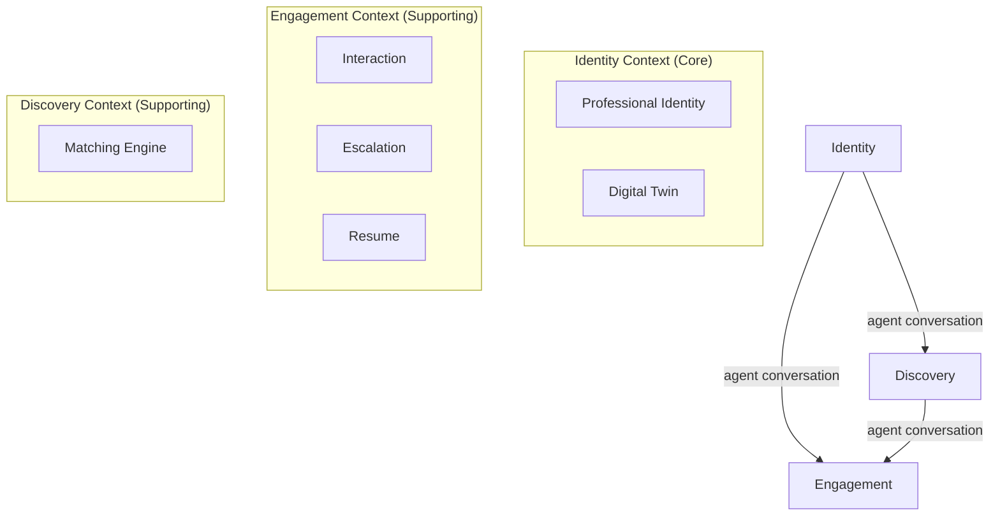

# Context Map

This document visualizes the relationships between the Bounded Contexts in libre-cv.

## Integration Pattern

Contexts communicate through **agent-to-agent conversations** using the Ubiquitous Language. Each context maintains its own internal model, and agents translate between contexts conversationally rather than through shared models or rigid API contracts.

## Mermaid Diagram

## Relationship Definitions

### Identity → Engagement (Upstream → Downstream)
The Engagement Context's agent asks the Identity Context's agent about the Owner's Professional Identity during Interactions. For example, when a Visitor asks a question, the Engagement agent queries the Identity agent for relevant information. The Identity agent decides what to share based on the Owner's Digital Twin configuration.

### Identity → Discovery (Upstream → Downstream)
The Discovery Context's agent queries the Identity Context's agent to understand what Opportunities are relevant to the Owner, and to determine whether a Visitor's search criteria match the Owner's Professional Identity.

### Discovery → Engagement (Upstream → Downstream)
When the Discovery Context proactively finds a relevant Opportunity, it can initiate an outbound Interaction in the Engagement Context on behalf of the Owner (e.g. reaching out to a recruiter). In the inbound case (a Visitor finding a Digital Twin), Discovery only surfaces results — the Visitor initiates the Interaction independently.
